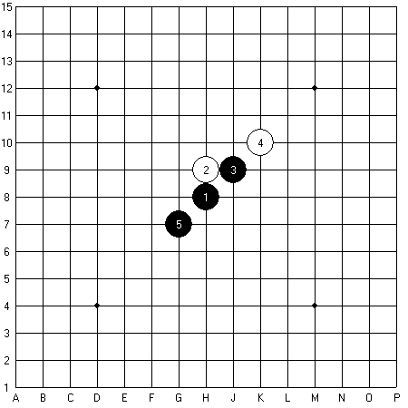
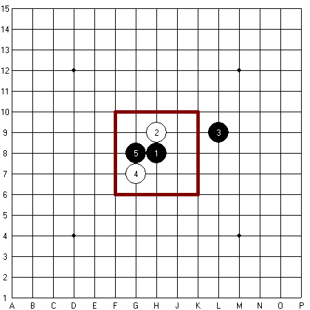
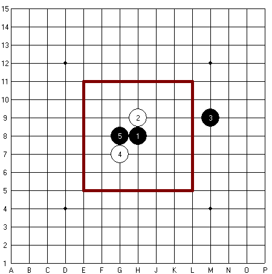
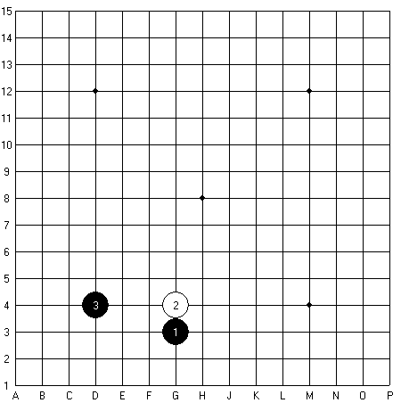
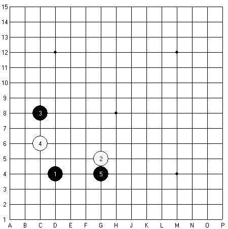

As the time has passed it had been realized and later was proved that if there is no restriction in the beginning of the game, the starting player will win the game. (The starting player is always black.)

It does not mean that in real games the starting player always wins the game. When a weaker player meets with a stronger one obviously the strong player will win the game irrespective of who was the starting one. Mathematically it is proved that if there's no restriction of opening rules, the first player will win, because the second player has no chance to avoid being defeated if the first player does not make any mistakes. A standard strategy stealing argument from combinatorial game theory shows that in no m,n,k-game can there be a strategy that assures that the second player will win.

According to these facts several opening rules were created so as to ensure an equalled game and give chance to the second player as well.

Main opening rules:
- STANDARD
- PRO
- LONG PRO
- SWAP
- SWAP2

## Standard

Black plays first, and players alternate in placing a stone of their colour on an empty intersection. There's no restriction where to put, the players put their stones alternately until an unbroken row of five stones are collected either horizontally, vertically, or diagonally.

This rule is 100% black win mathematically.

## Pro

The starting player (black) puts the first stone to the middle intersection of the board (H8), this move is compulsory. The second player can put the second move anywhere on the board. Now it's black's turn and the third move has to be outside a 5x5 square from the centre of the board (H8).

This restriction stands for a more balanced game in which black's first two stones are not so close to each other so black cannot have so many opportunities and white can equal the game and has better chances to win.

This rule ensures black surewin aswell, however white player begins the game from a smaller disadvantage.

## Long Pro

The first move of the starting player (black) is compulsory to be put to the middle intersection of the board (H8). Then the second player (white) can put the second stone anywhere on the board. The 3rd move must be put outside a 7x7 square. The centre of the square is the first black stone on H8.

This restriction ensures that white gets more possibilities to equal the game because the first two stones of black are not so close to each other so black has no surewin. Long pro is an upgrade of pro rule. The essence of long pro is that black has to put his/her second stone further than in standard or pro.

Hereby the game becomes more equal and white has more chance in this opening rule than in standard or pro games.

Long pro opening rule is suitable for serious games because it does not have so much importance who opens and who can start the game, black's chances nearly equals to white's chances.

## Swap

The starting player puts the first three stones anywhere on the board (two black stones and a white one). The second player can decide whether s/he wants to stay at white and put a fourth stone or s/he can swap and control the black stones. After this ceremony the players keep on moving till someone gets five in a row.

This opening rule equals chances much more than the three others mentioned before. The starting player is forced not to put an opening shape which would be too advantageous for one of the colours.

## Swap2

The first player puts three stones (two blacks and one white) on any intersections of the gomoku board. The second player has three options now:

- s/he can choose white and puts the 4th stone
- s/he can swap and controls the black stones
- s/he can put two more stones (one black and one white stone) so there will be a position composed of five stones on the board and s/he passes the opportunity to choose colour to the opponent.

If the first player puts a position from three stones which is hard to decide whether it is black’s or white’s advantage, the second player can live with the 3rd option (to put two more stones) and pass the decision of choosing the colour back to the first player.

